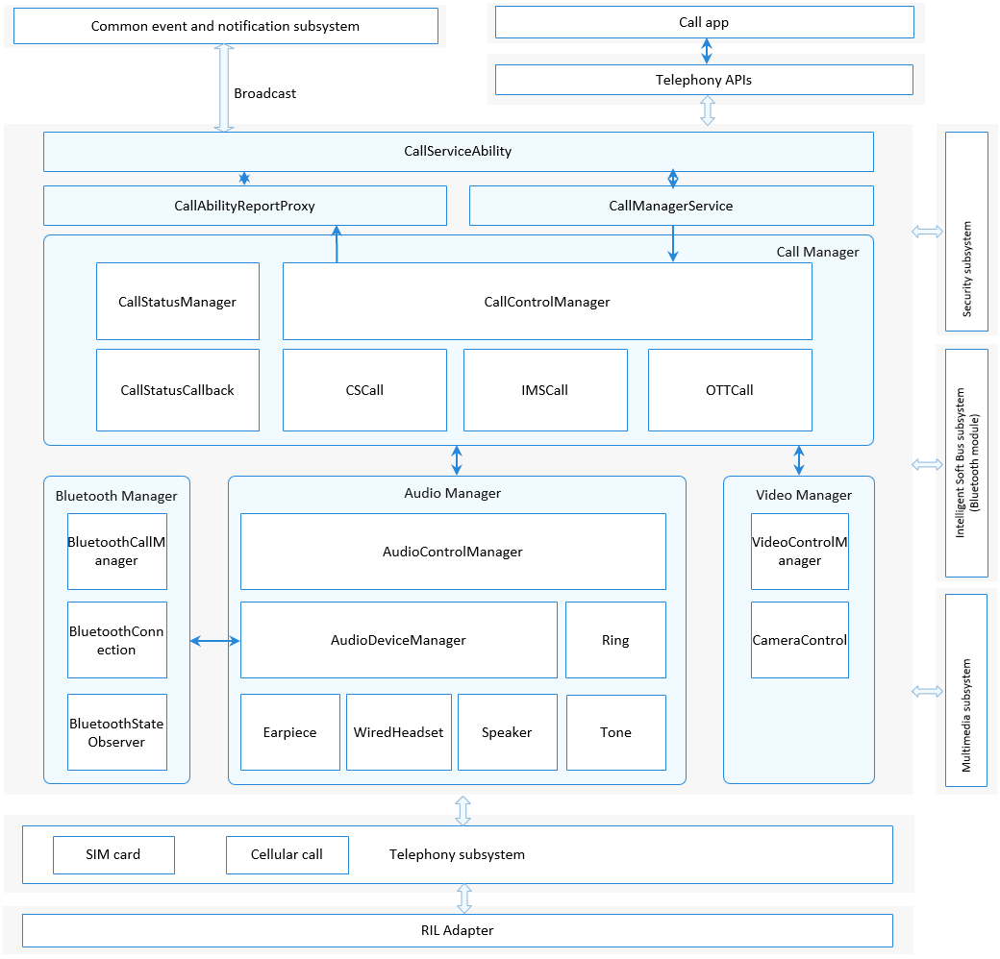

# Call Manager<a name="EN-US_TOPIC_0000001105058232"></a>

-   [Introduction](#section117mcpsimp)
-   [Directory Structure](#section128mcpsimp)
-   [Constraints](#section131mcpsimp)
-   [Available APIs](#section136mcpsimp)
-   [Usage Guidelines](#section163mcpsimp)
    -   [Calling the dial API to Place a Call](#section113291522113518)

-   [Repositories Involved](#section227mcpsimp)

## Introduction<a name="section117mcpsimp"></a>

The Call Manager module mainly manages three types of calls: circuit switched \(CS\), IP multimedia subsystem \(IMS\), and over the top \(OTT\) calls. It is responsible for requesting the audio and video resources for a call and resolving conflicts in a multi-channel call. The Call Manager module consists of the following parts:

1.  UI interaction \(CallServiceAbility\): implements interaction with the call UI, for example, launching the keypad UI for dialup and reporting the incoming call status to the UI.
2.  Service management \(CallManagerService\): starts and initializes the Call Manager service.
3.  Call management \(Call Manager\): processes downlink call operations (such as dialup, answer, and onhook) and uplink call status (such as incoming call status and call waiting status), and resolves conflicts that occur in a call.
4.  Audio management \(Audio Manager\): requests audio resources for a call and releases the resources after the call ends. This part depends on the Multimedia subsystem and therefore needs to call APIs of the Multimedia subsystem to perform audio-related operations.
5.  Video management \(Video Manager\): requests video resources for a call and releases the resources after the call ends. This part depends on the Multimedia subsystem and therefore needs to call APIs of the Multimedia subsystem to perform video-related operations.
6.  Bluetooth management \(Bluetooth Manager\): applies for Bluetooth resources for a call and releases the resources after the call ends. Besides, this part processes call operations initiated by Bluetooth devices, such as answering and ending calls.

The following figure shows the architecture of the Call Manager module.

**Figure  1**  Architecture of the Call Manager module<a name="fig11440121615591"></a>




## Directory Structure<a name="section128mcpsimp"></a>

```
/base/telephony/call_manager
├─ frameworks                              # NAPIs
├─ interfaces                              # External APIs
│  ├─ innerkits                            # Internal APIs
│  └─ kits                                 # JS APIs
├─ sa_profile                              # SA profile
├─ services                                # Service code
│  ├─ audio                                # Audio management
│  ├─ bluetooth                            # Bluetooth call management
│  ├─ call                                 # Call service
│  ├─ call_manager_service                 # Call Manager service
│  ├─ call_setting                         # Call setting
│  ├─ telephony_interaction                # Telephony core service interaction
│  └─ call_ui_interaction                  # UI interaction 
├─ test                                    # Unit test 
└─ utils                                   # Utilities
```

## Constraints<a name="section131mcpsimp"></a>

-   Programming language: JavaScript
-   Software constraints: This module must work with the Security subsystem, Multimedia subsystem, and DSoftBus subsystem \(Bluetooth module\), as well as the telephony core service \(core\_service\) and cellular call module \(cellular\_call\).
-   Hardware constraints: The accommodating device must be equipped with a speaker or earphone, and a headset.

## Available APIs<a name="section136mcpsimp"></a>

**Table  1**  External API provided by the Call Manager module

<a name="table137mcpsimp"></a>

| API| Description| Required Permission|
| ------------------------------------------------------------ | ------------------------------------ | -------------------------- |
| function dial(phoneNumber: string, options: DialOptions, callback: AsyncCallback<boolean\>): void; | Performs dialup operations.| ohos.permission.PLACE_CALL |

**Table  2**  Parameters of the dial API

<a name="table18488202215170"></a>

| Parameter| Description|
| --------------------------------- | ------------------------------------------------- |
| phoneNumber: string               | Phone number.|
| options: DialOptions              | Dial options. For details, see Table 3.|
| callback: AsyncCallback<boolean\> | Asynchronous execution result. The value **true** indicates that the dialup is successful, and value **false** indicates that the dialup has failed.|

**Table  3**  Description of DialOptions

<a name="table1322739190"></a>

| Parameter| Type| Description| Mandatory| Default Value|
| ------ | ------- | ---------------------- | -------- | ------ |
| extras | boolean | The value **true** indicates video, and value **false** indicates audio.| No| false  |


For details about the complete description of JavaScript APIs and sample code, see [Call](https://gitee.com/openharmony/docs/blob/master/en/application-dev/js-reference/apis/js-apis-call.md).
## Usage Guidelines<a name="section163mcpsimp"></a>

### Calling the dial API to Place a Call<a name="section113291522113518"></a> 

1.  Construct the **phoneNumber** and **options** parameters.
2.  Call the **dial** API in callback or promise mode.
3.  Obtain the dialup result. The **dial** API works in asynchronous mode. The dial result is returned through the callback.

    ```
    import call from "@ohos.telephony.call";
    
    let phoneNumber = "12312312312";
    
    // Call the API in callback mode.
    call.dial(phoneNumber, {extras: false}, (err, value) => {
      if (err) {
        // If the API call fails, err is not empty.
        console.error(`failed to dial because ${err.message}`);
        return;
      }
      // If the API call is successful, err is empty.
      console.log(`success to dial: ${value}`);
    });
    
    // Call the API in promise mode.
    let promise = call.dial(phoneNumber, {extras: false});
    promise.then((value) => {
      // The API call is successful.
      console.log(`success to dial: ${value}`);
    }).catch((err) => {
      // The API call fails.
      console.error(`failed to dial because ${err.message}`);
    });
    ```


## Repositories Involved<a name="section227mcpsimp"></a>

[Telephony Subsystem](https://gitee.com/openharmony/docs/blob/master/en/readme/telephony.md)

**telephony_call_manager**

[telephony_core_service](https://gitee.com/openharmony/telephony_core_service/blob/master/README.md)

[telephony_cellular_call](https://gitee.com/openharmony/telephony_cellular_call/blob/master/README.md)

[telephony_state_registry](https://gitee.com/openharmony/telephony_state_registry/blob/master/README.md)
