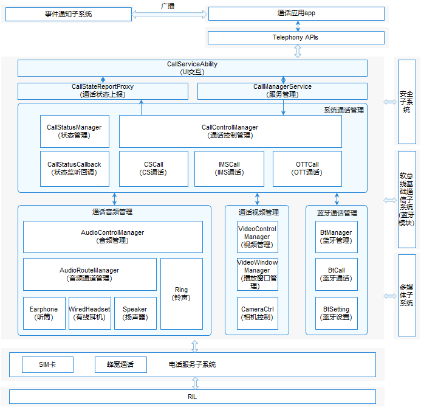

# 通话管理<a name="ZH-CN_TOPIC_0000001105058232"></a>

-   [简介](#section117mcpsimp)
-   [目录](#section128mcpsimp)
-   [约束](#section131mcpsimp)
-   [接口说明](#section136mcpsimp)
-   [使用说明](#section163mcpsimp)
    -   [拨打电话接口调用流程及示例代码](#section113291522113518)

-   [相关仓](#section227mcpsimp)

## 简介<a name="section117mcpsimp"></a>

通话管理模块主要管理CS（Circuit Switch，电路交换）、IMS（IP Multimedia Subsystem，IP多媒体子系统）和OTT（over the top，OTT解决方案）三种类型的通话，负责申请通话所需要的音视频资源，并处理多路通话时产生的各种冲突。通话管理主要分为UI交互、服务管理、系统通话管理、通话音频管理、通话视频管理和蓝牙通话管理六大模块，各模块简介如下：

1.  UI交互模块：负责和通话UI交互，如UI调用接口拨号，上报来电等状态给UI。
2.  服务管理模块：负责启动和初始化系统通话管理服务。
3.  系统通话管理模块：负责处理通话下行操作（如拨号、接听、挂断等）和上行状态（来电状态、呼叫等待状态等）的处理，并解决通话过程中产生的冲突。
4.  通话音频管理模块：负责通话时需要的音频资源的申请和释放，依赖多媒体子系统，需要调用多媒体子系统接口进行音频相关的操作。
5.  通话视频管理模块：负责通话时需要的视频资源的申请和释放，依赖多媒体子系统，需要调用多媒体子系统接口进行视频相关的操作。
6.  蓝牙通话管理模块：负责通话时需要的蓝牙资源的申请和释放，并处理蓝牙设备发起的通话操作，如接听和挂断等。

其主要的结构及流程如下图所示：

**图 1**  通话管理模块架构图<a name="fig11440121615591"></a>




## 目录<a name="section128mcpsimp"></a>

```
/base/telephony/call_manager
├─ frameworks                              # napi接口存放目录
├─ interfaces                              # 对外部暴露的接口
│  ├─ innerkits                            # 部件间的内部接口
│  └─ kits                                 # js接口存放目录
├─ sa_profile                              # 启动配置文件
├─ services                                # 服务内部代码
│  ├─ audio                                # 音频管理相关代码
│  ├─ bluetooth                            # 蓝牙通话相关代码
│  ├─ call                                 # 通话业务相关代码
│  ├─ call_manager_service                 # 进程服务管理相关代码
│  ├─ call_setting                         # 通话设置相关代码
│  ├─ telephony_interaction                # 电话核心服务交互相关代码
│  └─ call_ui_interaction                  # UI交互相关代码
├─ test                                    # 单元测试相关代码
└─ utils                                   # 通用工具类
```

## 约束<a name="section131mcpsimp"></a>

-   开发语言：JavaScript。
-   软件上，需要与以下子系统和服务配合使用：安全子系统，多媒体子系统，软总线基础通信子系统\(蓝牙模块\)，Telephony核心服务（core\_service），蜂窝通话服务（cellular\_call）。
-   硬件上，需要搭载的设备支持以下硬件：扬声器或听筒、麦克风。

## 接口说明<a name="section136mcpsimp"></a>

**表 1**  通话管理对外提供的接口

<a name="table137mcpsimp"></a>

| 接口内容                                                     | 接口描述                             | 所需权限                   |
| ------------------------------------------------------------ | ------------------------------------ | -------------------------- |
| function dial(phoneNumber: string, options: DialOptions, callback: AsyncCallback<boolean\>): void; | 拨号接口，调用此接口可以进行拨号操作 | ohos.permission.PLACE_CALL |

**表 2**  拨号接口参数说明

<a name="table18488202215170"></a>

| 参数                              | 描述                                              |
| --------------------------------- | ------------------------------------------------- |
| phoneNumber: string               | 电话号码                                          |
| options: DialOptions              | 扩展参数（详见下表）                              |
| callback: AsyncCallback<boolean\> | 异步执行结果，true表示执行成功，false表示执行失败 |

**表 3**  options: DialOptions参数说明

<a name="table1322739190"></a>

| 参数   | 类型    | 描述                   | 是否必填 | 默认值 |
| ------ | ------- | ---------------------- | -------- | ------ |
| extras | boolean | false：音频 true：视频 | 否       | false  |


完整的JS API说明以及实例代码请参考：[拨打电话](https://gitee.com/openharmony/docs/blob/master/zh-cn/application-dev/js-reference/apis/js-apis-call.md)。
## 使用说明<a name="section163mcpsimp"></a>

### 拨打电话接口调用流程及示例代码<a name="section113291522113518"></a>

1.  构造phoneNumber和options参数；
2.  可以通过callback或者Promise的方式调用dial接口。
3.  该接口为异步接口，相关执行结果会从callback中返回。

    ```
    import call from "@ohos.telephony.call";
    
    let phoneNumber = "12312312312";
    
    // 调用接口【callback方式】
    call.dial(phoneNumber, {extras: false}, (err, value) => {
      if (err) {
        // 接口调用失败，err非空
        console.error(`failed to dial because ${err.message}`);
        return;
      }
      // 接口调用成功，err为空
      console.log(`success to dial: ${value}`);
    });
    
    // 调用接口【Promise方式】
    let promise = call.dial(phoneNumber, {extras: false});
    promise.then((value) => {
      // 接口调用成功，此处可以实现成功场景分支代码。
      console.log(`success to dial: ${value}`);
    }).catch((err) => {
      // 接口调用失败，此处可以实现失败场景分支代码。
      console.error(`failed to dial because ${err.message}`);
    });
    ```


## 相关仓<a name="section227mcpsimp"></a>

[电话服务子系统](https://gitee.com/openharmony/docs/blob/master/zh-cn/readme/%E7%94%B5%E8%AF%9D%E6%9C%8D%E5%8A%A1%E5%AD%90%E7%B3%BB%E7%BB%9F.md)

**telephony_call_manager**

[telephony_core_service](https://gitee.com/openharmony/telephony_core_service/blob/master/README_zh.md)

[telephony_cellular_call](https://gitee.com/openharmony/telephony_cellular_call/blob/master/README_zh.md)

[telephony_state_registry](https://gitee.com/openharmony/telephony_state_registry/blob/master/README_zh.md)